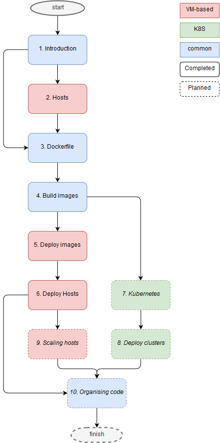

# Meta-pipelines - Introduction

Welcome. This series of articles will go in details of automating Azure Pipelines infrastructure itself.
The text is accompanied by a [source code repository](https://github.com/giuliov/pipeline-your-pipelines) publicly available on GitHub.

## Scenario and Problems

Imagine yourself in the scenario of an independent team responsible of maintaining its own build pipeline.
Typical solutions are:

1. Grab a leftover desktop or server machine
2. Ask the IT department for a virtual machine
3. Buy a VM in the cloud
4. Use the standard hosted agents provided by Azure Pipelines

These solutions share some common problems.
What if we need to go back in time, five years from today and build an old version of software? Probably these machines are lost or they evolved and do not contain the same version of software.
Or maybe I need to use the latest and greatest for one build but have to run an older version of our toolchain to support laggard customers?

Another problem is build environment hysteresis: with this I mean the phenomenon where your build outcome may depend on the build server status. It maybe a requirement for incremental builds or a danger as the artefacts turn out unreliable.
The ability to completely scrap the build environment and start from clean from trusted sources minimises security risks that malicious code might be injected in your artefacts.

## Elements of a Solution

Docker can solve the problem by guaranteeing a good degree of reproducibility: we can be very specific about the software we install and also keep any previously used image in a safe location. Using Docker volumes we will get full control on build state: keep it or clean it every time.

The plan is to dockerize Azure Pipelines Agents, so they can be quickly rebuilt and cheaply archived using a Registry. To run such agents we need some kind of hosts: we will see both using virtual machine-based hosts and Kubernetes, with consideration for on-premise and cloud scenarios.

While in this series I demonstrate the techniques using Azure, they can be used on-premise or translated for a different cloud provider.

## I do not have this problem

If you are not facing this scenario — whatever build agents the pipeline gives to you, satisfies your needs — you can still learn a lot about trendy technologies in a practical context. We will demonstrate:

- Azure Virtual Machines
- Azure Kubernetes Service
- Terraform
- Docker
- Kubernetes
- Azure Pipelines & Azure DevOps

working together in a orchestrated dance.
Another gain from this series is the DevOps perspective: looking to a problem globally, automate as a way of documenting processes, delivery changes at the click of a button, scalability and security built-in.

## Table of Contents

The plan for the series is the following:

[1. Introduction](./1-Introduction.md) (_this page_)  
[2. Docker Hosts](./2-Hosts.md)  
[3. Dockerize the agent](./3-Dockerfile.md)  
[4. Build and Registry](./4-Build_images.md)  
[5. Deploy and Run agent](./5-Deploy_images.md)  
[6. Automating the Host Environments](./6-Deploy_hosts.md)  
7. Host agents in Kubernetes (_planned_)  
8. Automating the Kubernetes Environments (_planned_)  
9. Scaling Hosts (_planned_)  
10. Organising code and resources (_planned_)  

You can go in sequential order or select a different path if you are not interested in managing the host machines, as depicted in the flowchart.

## Notes

Diagrams were drawn using [draw.io](https://www.draw.io/) and saved in the images folder as PNG files with embedded diagram.

Pull Requests are always welcome!
