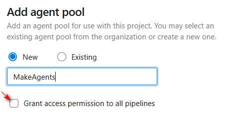
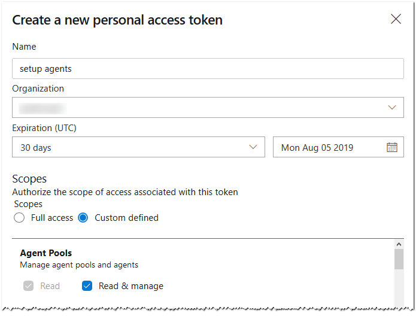
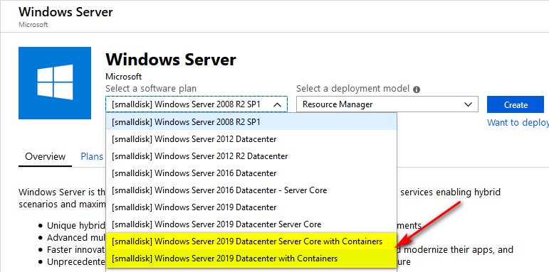
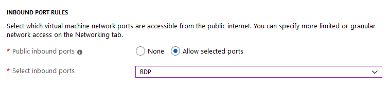
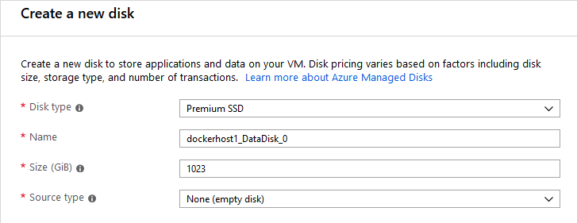
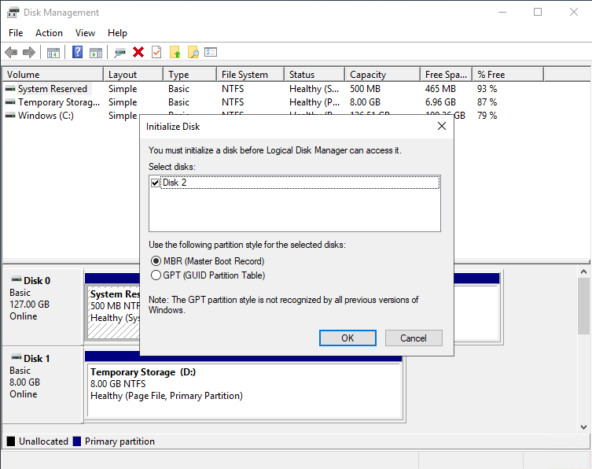
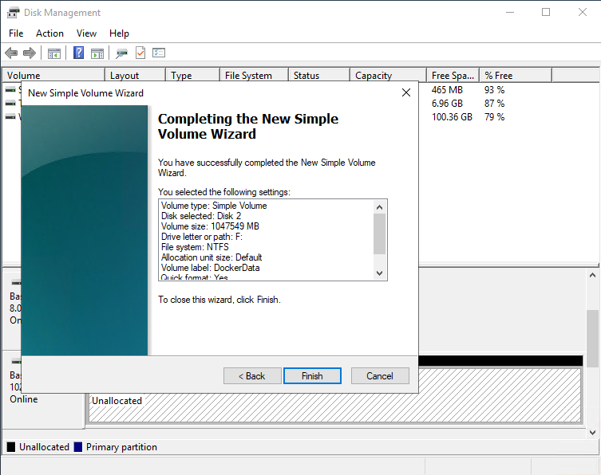
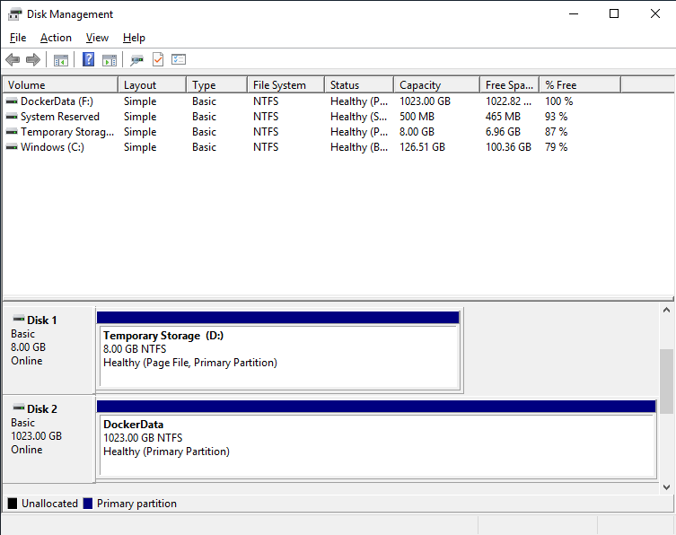
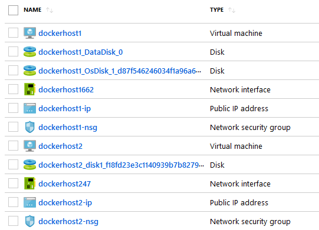
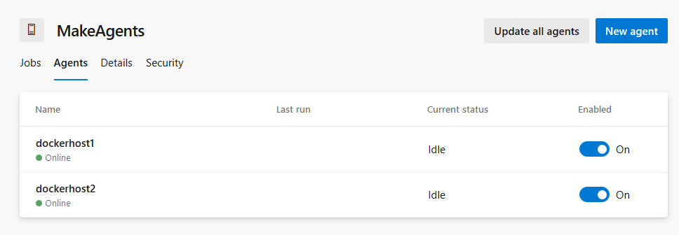

# Meta-pipelines - Part 1 - Docker Hosts

The first step will be to setup an environment where we can run Docker and is the topic for this instalment.

We need at least two kinds of hosts: a Windows and a Linux machines. Simple reason: you cannot run Windows containers on a Linux host, also running Linux containers on a Windows machine is inefficient (they truly run inside a virtual machine).
Windows support for Docker is tied to specific kernel versions. My advice is to standardize on Windows Server 2019 as host.
In this series I will setup the hosts in Azure for convenience, but you can have them on-premise or use a different cloud as well.

The hosts ends having just three components installed :

- Docker
- Azure Pipeline Agent
- PowerShell 6  
This latter will be used by the build pipeline script in part 3.

If you need a primer on Docker there are plenty of resources, from the excellent [The Docker Book](https://dockerbook.com/) to the [official documentation](https://docs.docker.com/), Pluralsight courses, etc.

## Azure Pipelines

Use an [ad-hoc Agents Pool](https://docs.microsoft.com/en-us/azure/devops/pipelines/agents/pools-queues#creating-agent-pools), named **MakeAgents** or similar.



Avoid enabling the _Grant access permission to all pipelines_ setting, prefer in this case more control and enable individual pipelines to use this Pool.
You can additionally restrict permission to this and avoid queueing normal builds on it.

I find it convenient to use a Personal Access Token (PAT from now on) to setup the agents. Bare in mind that the PAT has an expiry date of maximum one year, so you will need to create a new one and apply it to the process.



You may wonder why using a separate Pool. This queue will be dedicated to agents on _hosts_ to run "meta"-pipelines. They requires local admin permissions and have no build toolchain, just Docker, so any normal build will fail.

## The Windows Host

This example use the Azure Portal, but it is easy to translate the process using automation tools like Terraform or Ansible.

Follow the instruction in [Create a Windows virtual machine](https://docs.microsoft.com/en-us/azure/virtual-machines/windows/quick-create-portal), make sure to select **Windows Server 2019 Datacenter with Containers**.



We need to work on this machine later so allow RDP connections



I prefer using a separate data disk for docker so add one.



When the machine is ready, connect to it and format the data disk assigning the drive letter `F:`





Resulting in this layout



Now we can move Docker working directory to this data disk.
Run these commands in an elevated PowerShell prompt.

```Powershell
mkdir F:\docker-data
'{ "data-root": "F:\\docker-data", "storage-opts": ["size=120GB"] }' | Out-File -Encoding Ascii -Filepath "C:\ProgramData\docker\config\daemon.json"
Restart-Service docker
```

Note that Docker is preinstalled and configured on this VM image.

You can check that Docker is still working by running these commands.

```Batchfile
docker pull hello-world
docker run --rm -it hello-world
```

The `F:\docker-data` directory should be populated and use 100MB of disk or so.

Install PowerShell 6: it will be required as we progress in the series.

```Powershell
mkdir F:\Temp
pushd F:\Temp
$pkg = 'PowerShell-6.2.1-win-x64.msi'
curl -OutFile $pkg https://github.com/PowerShell/PowerShell/releases/download/v6.2.1/$pkg
if ((Get-FileHash $pkg -Algorithm sha256).Hash -eq 'C24406CA8F65440FA0381E417B05A16161227276EB3B77091FDB9D174B7F3144') {
    msiexec /qb /norestart /i $pkg
} else {
    Write-Error "Downloaded package doesn't match the hash!"
}
```

Install the Azure Pipelines agent on the host; Git is required for the agent to work.
You may have to use an older version of the agent for TFS/Azure DevOps Server; please check the [guidance](https://docs.microsoft.com/en-us/azure/devops/pipelines/agents/v2-windows).

```Powershell
$pkg = 'Git-2.22.0-64-bit.exe'
curl -OutFile $pkg https://github.com/git-for-windows/git/releases/download/v2.22.0.windows.1/$pkg
# Install Git for Windows
if ((Get-FileHash $pkg -Algorithm sha256).Hash -eq '0c314a62f0f242c64fe1bdae20ab113fef990fb7e3323d0989478b6ed396d00b') {
    & "./$pkg" /SILENT
} else {
    Write-Error "Downloaded package doesn't match the hash!"
}
exit
```

We exited the previous shell so now Git is visible in the PATH for the Agent.

```Powershell
pushd F:\Temp
# Install Azure Pipelines Agent
$pkg = 'vsts-agent-win-x64-2.154.1.zip'
curl -OutFile $pkg https://vstsagentpackage.azureedge.net/agent/2.154.1/$pkg
if ((Get-FileHash $pkg -Algorithm sha256).Hash -eq '67634CC6B9D0A7F373940F08E6F76FE8A04CE3B765FAF9E693836F35289A08B1') {
    Expand-Archive -Path $pkg -DestinationPath F:\Agents\A1
    cd F:\Agents\A1
    .\config.cmd --pool MakeAgents --acceptTeeEula --runAsService --windowsLogonAccount "NT AUTHORITY\SYSTEM"
} else {
    Write-Error "Downloaded package doesn't match the hash!"
}
popd
```

`.\config.cmd` will prompt for logon information. If you prefer using another account instead of System, make sure it has administrative privileges on the machine.

## The Linux Host

Create a VM as before, using the [guide](https://docs.microsoft.com/en-us/azure/virtual-machines/linux/quick-create-portal), please select **Ubuntu 18.04 VM** for the OS and let port 22 available for SSH.

When the machine creation is complete, connect to it and run the following commands to install Docker and the Azure Pipelines agent.
You may want to read the [guidance](https://docs.microsoft.com/en-us/azure/devops/pipelines/agents/v2-linux) for installing the agent on Linux.

```bash
sudo apt-get install -y docker.io
# see https://docs.docker.com/install/linux/linux-postinstall/
sudo groupadd docker
sudo usermod -aG docker $USER
sudo reboot
```

```bash
# reconnect and validate docker install
docker run hello-world

# install Powershell 6
# see https://docs.microsoft.com/en-us/powershell/scripting/install/installing-powershell-core-on-linux?view=powershell-6
wget -q https://packages.microsoft.com/config/ubuntu/18.04/packages-microsoft-prod.deb
sudo dpkg -i packages-microsoft-prod.deb
sudo apt-get update
sudo add-apt-repository universe
sudo apt-get install -y powershell

# finally get and configure the agent
curl https://vstsagentpackage.azureedge.net/agent/2.153.2/vsts-agent-linux-x64-2.153.2.tar.gz -o vsts-agent-linux-x64-2.153.2.tar.gz
echo "59566e23ee745f47a8391b59f9e3de596abb5cdf425dbcd2aba155e43b6f0ab9 *vsts-agent-linux-x64-2.153.2.tar.gz" | sha256sum -c -
if [ $? != 0 ]; then
  echo "Downloaded package doesn't match the hash!"
  exit 1
fi
mkdir pipeline-agent
cd pipeline-agent
tar zxvf ../vsts-agent-linux-x64-2.153.2.tar.gz
./config.sh --pool MakeAgents --acceptTeeEula
sudo ./svc.sh install
sudo ./svc.sh start
```

## What's next

If all went well we have two VMs visible in Azure Portal



and two Agents in the **MakeAgents** Pool.



These two Azure Pipelines Agents can run docker.
In future posts we will go in details how to use this capability.
