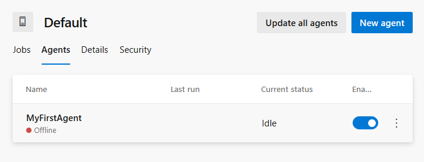
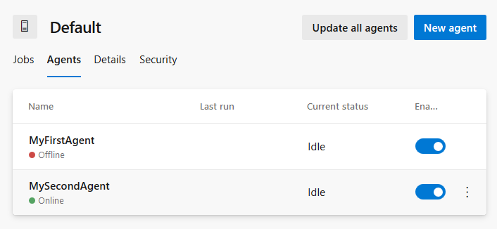

# Meta-pipelines - Part 2 - Dockerize the agent

In the previous instalment we setup a couple of machines to run Docker and host docker containers. In this post, we will explore the structure of a Dockerfile for Azure Pipelines/TFS Agent.

> There is a notable difference between Azure DevOps Service and Server in terms of handling agent updates.
> The first part of this article can be used in air-gapped environments.

If you need a primer on Docker there is plenty of resources, from the excellent [The Docker Book](https://dockerbook.com/) to the [official documentation](https://docs.docker.com/), Pluralsight courses, etc.

## Dockerfile for a Windows Azure Pipelines agent

This sample Docker file leverages Docker multi-stage build feature to download the Agent and the SDK binaries. Note that the agent version is defined in the Docker file, which works perfectly on the TFS/Azure DevOps Server scenario. More on the Azure DevOps Service scenario later.

To use a different toolchain, say .Net Core 3.0, you change the section marked `toolchain download` to download whatever SDK and tool you need to install, and also the `toolchain setup` section.

```Dockerfile
# escape=`

FROM mcr.microsoft.com/windows/servercore:ltsc2019 AS agent

SHELL ["powershell", "-Command", "$ErrorActionPreference = 'Stop'; $ProgressPreference = 'SilentlyContinue';"]

ENV AGENT_VERSION 2.154.1
ENV AGENT_SHA256 67634CC6B9D0A7F373940F08E6F76FE8A04CE3B765FAF9E693836F35289A08B1

RUN Invoke-WebRequest -OutFile agent.zip https://vstsagentpackage.azureedge.net/agent/$env:AGENT_VERSION/vsts-agent-win-x64-$env:AGENT_VERSION.zip; `
    if ((Get-FileHash agent.zip -Algorithm sha256).Hash -ne $Env:AGENT_SHA256) { `
        Write-Host 'CHECKSUM VERIFICATION FAILED!'; `
        exit 1; `
    }; `
    Expand-Archive -Path agent.zip -DestinationPath C:\BuildAgent ; `
    Remove-Item -Path agent.zip


# ----- toolchain download start -----
# see https://github.com/dotnet/dotnet-docker/blob/master/2.2/sdk/nanoserver-1809/amd64/Dockerfile
FROM mcr.microsoft.com/windows/servercore:ltsc2019 AS toolchain

SHELL ["powershell", "-Command", "$ErrorActionPreference = 'Stop'; $ProgressPreference = 'SilentlyContinue';"]

# do not bump to 3.0 without changing the next FROM section
ENV DOTNET_SDK_VERSION 2.2.105
ENV DOTNET_SHA512 d58b0b3f2f82f3960b84e1a7ee36c4febc28db9e08bb99a6dd0b61e5812631d935c471a5ba2f90c966fbcddb208454948339ee5c0d7fbaee4168f3fe6c0827f4

RUN Invoke-WebRequest -OutFile dotnet.zip https://dotnetcli.blob.core.windows.net/dotnet/Sdk/$Env:DOTNET_SDK_VERSION/dotnet-sdk-$Env:DOTNET_SDK_VERSION-win-x64.zip; `
    if ((Get-FileHash dotnet.zip -Algorithm sha512).Hash -ne $Env:DOTNET_SHA512) { `
        Write-Host 'CHECKSUM VERIFICATION FAILED!'; `
        exit 1; `
    }; `
    Expand-Archive dotnet.zip -DestinationPath C:\dotnet; `
    Remove-Item -Force dotnet.zip
# -----  toolchain download end  -----


FROM mcr.microsoft.com/windows/servercore:ltsc2019

SHELL ["powershell", "-Command", "$ErrorActionPreference = 'Stop'; $ProgressPreference = 'SilentlyContinue';"]

# ----- toolchain setup start -----
COPY --from=toolchain ["C:/dotnet", "C:/dotnet"]
RUN setx /M PATH $('C:\dotnet;' + $Env:PATH)

# variables to define Capabilities
ENV dotnetcore_2.2=true
# -----  toolchain setup end  -----
# must be passed to run command, we use some bogus values here to highlight what is missing
ENV AZP_URL=tfs.example.com
ENV AZP_TOKEN=invalid_PAT
ENV AZP_POOL=Default
ENV AZP_AGENT_NAME=$env:COMPUTERNAME
ENV AZP_WORK=_work
# VSO_AGENT_IGNORE contains comma delimited list of vars not to publish as capabilities by Agent
ENV VSO_AGENT_IGNORE="VSO_AGENT_IGNORE,AZP_AGENT_NAME,AZP_URL,AZP_TOKEN,AZP_POOL"

WORKDIR C:/BuildAgent

COPY --from=agent ["C:/BuildAgent", "C:/BuildAgent"]

ENTRYPOINT .\bin\Agent.Listener.exe configure --unattended `
    --agent "$env:AZP_AGENT_NAME" `
    --url "$env:AZP_URL" `
    --auth PAT `
    --token "$env:AZP_TOKEN" `
    --pool "$env:AZP_POOL" `
    --work "_work" `
    --replace; `
    .\bin\Agent.Listener.exe run
```

There are very few notable things.

One is the use of environment variables to add Capabilities for Azure Pipelines.
Using `setx` changes the system PATH before launching the agent; also explicitly put the SDK first in line for commands.
The last trick is to use the `VSO_AGENT_IGNORE` environment variable: the agent will hide environment variables listed here from build scripts and tasks.

Note that the Dockerfile states explicitly the versions of Agent and .Net Core SDK to use. This is on purpose: we want fine control over the tool chain used in our builds.

Checking the hash of downloaded files is a good practice to avoid tampering. SHA 512 is currently recommended over SHA1.
The `--replace` options permits to re-register the agent with the same name.

You may wonder why configuring the agent in the ENTRYPOINT clause instead of using a RUN. The reason is to allow instantiating multiple agents from the same image. If we used a RUN, the agent configuration would be hardcoded in the image.

## Dockerfile to image

To validate, we can connect to the Windows VM created in part 1.

To create the Docker image in the local host cache, that is on the machine where you run the command, execute
`docker build -t azure-pipeline-netcore-sdk:2.2`.
This operation will take a good few minutes, especially if the base image was never pulled in, so it is a good moment to have a cup of tea or coffee.

The resulting docker image contains the binaries for the Azure Pipelines Agent and the toolchain, in the example .Net Core 2.2.

Docker build does not run nor registers the agent though. We have to start a container, that is a process, from the image.
Before we would need to collect the same information as if we were registering the agent manually:

- a valid [Personal Access Token](https://docs.microsoft.com/en-us/azure/devops/organizations/accounts/use-personal-access-tokens-to-authenticate?view=azure-devops) with **Agent Pools (read, manage)** permission
- the URL of the TFS server or the Azure DevOps Organization
- the name of the Agent Pool

We can conveniently put this data in an `env_file`, e.g.

```Batchfile
AZP_URL=https://dev.azure.com/yourorganization
AZP_POOL=Default
AZP_AGENT_NAME=MyFirstAgent
AZP_TOKEN=lrx6554vhogq7lknzznfi4uo75o4hlwfqw6mkr
AZP_WORK=_work
```

Now we can start a container named _test_, executing the command
`docker run --env-file .\env_file --rm --name test azure-pipeline-netcore-sdk:2.2`,
which should output

```Batchfile
>> Connect:

Connecting to server ...

>> Register Agent:

Scanning for tool capabilities.
Connecting to the server.
Successfully added the agent
Testing agent connection.
2019-07-06 14:42:46Z: Settings Saved.
Scanning for tool capabilities.
Connecting to the server.
2019-07-06 14:42:55Z: Listening for Jobs
```

After a few seconds, the agent will appear in Azure Pipelines.


By hitting `Ctrl+C` the console is back, but the container continues to run in the background.
To stop the container run `docker stop test`; Azure Pipeline will notice this and mark the agent offline.



We learned how to create as many Agents as we want on this host but, to properly manage images, we need a Docker Registry to share images between host machines. This will be detailed in the next article.

## Dockerfile for a Linux Azure Pipelines agent

After successfully being able to run an Azure Pipelines agent on Windows, let's do the same on Linux.

```Dockerfile
FROM alpine AS agent

ENV AGENT_VERSION 2.153.2
ENV AGENT_SHA256 59566e23ee745f47a8391b59f9e3de596abb5cdf425dbcd2aba155e43b6f0ab9

WORKDIR /agent

RUN apk add --no-cache curl

RUN curl -o vsts-agent-linux-x64.tgz https://vstsagentpackage.azureedge.net/agent/${AGENT_VERSION}/vsts-agent-linux-x64-${AGENT_VERSION}.tar.gz \
    && echo "${AGENT_SHA256} *vsts-agent-linux-x64.tgz" | sha256sum -c - \
    && tar zxvf vsts-agent-linux-x64.tgz \
    && rm vsts-agent-linux-x64.tgz


# ----- toolchain start -----
FROM node:12.6.0
# ----- toolchain end -----

# Azure Pipelines agent require git 2.9 or later
RUN apt-get install git -y

COPY --from=agent ["/agent", "/agent"]

USER root
WORKDIR /agent
COPY ./start.sh .
RUN chmod +x start.sh

ENTRYPOINT ["/bin/bash", "-c","/agent/start.sh"]
```

This Dockerfile is different because we are fine with an existing Docker image and just need to add the Linux agent to it.

More notable is the `start.sh` script

```bash
#!/bin/bash
set -e

if [ -z "$AZP_URL" ]; then
  echo 1>&2 error: missing AZP_URL environment variable
  exit 1
fi

if [ -z "$AZP_TOKEN_FILE" ]; then
  if [ -z "$AZP_TOKEN" ]; then
    echo 1>&2 error: missing AZP_TOKEN environment variable
    exit 1
  fi
  AZP_TOKEN_FILE=/agent/.token
  echo -n $AZP_TOKEN > "$AZP_TOKEN_FILE"
fi
unset AZP_TOKEN

if [ -n "$AZP_AGENT_NAME" ]; then
  export AZP_AGENT_NAME="$(eval echo $AZP_AGENT_NAME)"
fi

if [ -n "$AZP_WORK" ]; then
  export AZP_WORK="$(eval echo $AZP_WORK)"
  mkdir -p "$AZP_WORK"
fi

cd /agent

export VSO_AGENT_IGNORE=_,MAIL,OLDPWD,PATH,PWD,AZP_AGENT_NAME,AZP_URL,AZP_TOKEN_FILE,AZP_TOKEN,AZP_POOL,AZP_WORK,VSO_AGENT_IGNORE
if [ -n "$VSTS_AGENT_IGNORE" ]; then
  export VSO_AGENT_IGNORE=$VSO_AGENT_IGNORE,VSTS_AGENT_IGNORE,$VSTS_AGENT_IGNORE
fi

source ./env.sh

./bin/Agent.Listener configure --unattended \
  --agent "${AZP_AGENT_NAME:-$(hostname)}" \
  --url "$AZP_URL" \
  --auth PAT \
  --token $(cat "$AZP_TOKEN_FILE") \
  --pool "${AZP_POOL:-Default}" \
  --work "${AZP_WORK:-_work}" \
  --replace & wait $!

./bin/Agent.Listener run & wait $!
```

With these two files, we build the image executing `docker build -t azure-pipeline-node:12.6.0`.

To test, we run `docker run --env-file ./env_file --rm --name test azure-pipeline-node:12.6.0` after editing the `env_file`, e.g.

``` Bathcfile
AZP_URL=https://dev.azure.com/yourorganization
AZP_POOL=Default
AZP_AGENT_NAME=MySecondAgent
AZP_TOKEN=lrx6554vhogq7lknzznfi4uo75o4hlwfqw6mkr
AZP_WORK=_work
```

Note the different value for the agent name: it must be so or it will take the place of the Windows agent!

Now we have two agents registered.



## Azure DevOps Server and agent upgrades

The code above works perfectly fine when you have full control of upgrades, that is an on-premise Team Foundation Server or Azure DevOps Server.

Azure DevOps Service may upgrade without you noticing and there is a domino effect. The documentation states indeed in from [Q & A](https://docs.microsoft.com/en-us/azure/devops/pipelines/agents/agents?view=azure-devops#how-do-i-make-sure-i-have-the-latest-v2-agent-version) section that:
> Each agent automatically updates itself when it runs a task that requires a newer version of the agent.

This means that the agent may self-upgrade on occasion... and break the container!

What is the solution? It is described in [Running a self-hosted agent in Docker](https://docs.microsoft.com/en-us/azure/devops/pipelines/agents/docker): the idea is to download, configure and start the agent in a single action using a bootstrap script. I will not copy here the `start.ps1` and `start.sh` file; I will simply illustrate how to adapt the above Dockerfiles in this scenario.

> This approach will not function in air-gapped environments: the container requires internet access in addition to TFS/Azure DevOps Server.

### Azure Pipelines Service Windows Dockerfile

```Dockerfile
# escape=`

# ----- toolchain download start -----
# see https://github.com/dotnet/dotnet-docker/blob/master/2.2/sdk/nanoserver-1809/amd64/Dockerfile
FROM mcr.microsoft.com/windows/servercore:ltsc2019 AS toolchain

SHELL ["powershell", "-Command", "$ErrorActionPreference = 'Stop'; $ProgressPreference = 'SilentlyContinue';"]

# do not bump to 3.0 without changing the next FROM section
ENV DOTNET_SDK_VERSION 2.2.105
ENV DOTNET_SHA512 d58b0b3f2f82f3960b84e1a7ee36c4febc28db9e08bb99a6dd0b61e5812631d935c471a5ba2f90c966fbcddb208454948339ee5c0d7fbaee4168f3fe6c0827f4

RUN Invoke-WebRequest -OutFile dotnet.zip https://dotnetcli.blob.core.windows.net/dotnet/Sdk/$Env:DOTNET_SDK_VERSION/dotnet-sdk-$Env:DOTNET_SDK_VERSION-win-x64.zip; `
    if ((Get-FileHash dotnet.zip -Algorithm sha512).Hash -ne $Env:DOTNET_SHA512) { `
        Write-Host 'CHECKSUM VERIFICATION FAILED!'; `
        exit 1; `
    }; `
    Expand-Archive dotnet.zip -DestinationPath C:\dotnet; `
    Remove-Item -Force dotnet.zip
# -----  toolchain download end  -----


FROM mcr.microsoft.com/windows/servercore:ltsc2019

SHELL ["powershell", "-Command", "$ErrorActionPreference = 'Stop'; $ProgressPreference = 'SilentlyContinue';"]

# ----- toolchain setup start -----
COPY --from=toolchain ["C:/dotnet", "C:/dotnet"]
RUN setx /M PATH $('C:\dotnet;' + $Env:PATH)

# variables to define Capabilities
ENV dotnetcore_2.2=true
# -----  toolchain setup end  -----

# must be passed to run command, we use some bogus values here to highlight what is missing
ENV AZP_URL=tfs.example.com
ENV AZP_TOKEN=invalid_PAT
ENV AZP_POOL=Default
ENV AZP_AGENT_NAME=$env:COMPUTERNAME
ENV AZP_WORK=_work

WORKDIR C:/BuildAgent

COPY start.ps1 .

CMD powershell .\start.ps1
```

This image will be about 300 MB smaller without the agent image but the container will take many minutes to start, fail if it cannot connect to the Internet and use 100 MB more.

### Azure Pipelines Service Linux Dockerfile

```Dockerfile
FROM node:12.6.0

# Azure Pipelines agent require git 2.9 or later
RUN apt-get install git -y

USER root
WORKDIR /agent
COPY ./start.sh .
RUN chmod +x start.sh

CMD ["./start.sh"]
```

The considerations are similar to Windows: a leaner image but slower to start container which requires Internet access.

## Caching, incremental builds and working directory

In all examples above we have not specified a working directory for the agent. This is the recommended approach unless you have special requirements.

In the default scenario, the working directory is within the container image; if the container is restarted the content is lost. This can have an unpleasant effect on caching and break incremental builds that assume they are working on the same filesystem.

You may use an external volume, even living on a network share, for the agent working directory, if you specify these three things:

1. in the Dockerfile modify `ENV AZP_WORK=/agent_work` and add `VOLUME /agent_work`
2. create a volume for the container `docker volume create agent1-work`
3. start the container specifying the volume `docker run --mount source=agent1-work,target=/agent_work --env-file .\env_file --rm --name test azure-pipeline-netcore-sdk:2.2`

Docker volumes is a complex topic and I recommend to study the documentation at [Use volumes](https://docs.docker.com/storage/volumes).

## Limits of Docker approach

The container process has no Windows Identity for the host machine, so it cannot access Windows networks like SMB shares. As a consequence you cannot use UNC _file share_ for **Artifact publish location** in the Publish Artifacts Task.
Another issue is the Agent not being deleted when we stop the container.

And this is enough for a post, see you in the next instalment.
