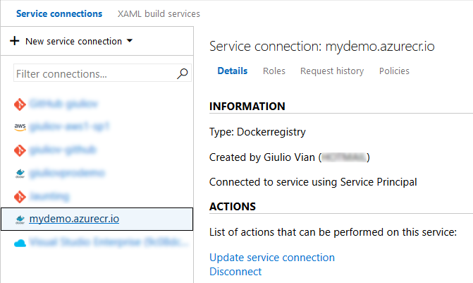
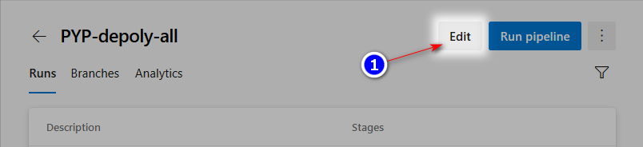
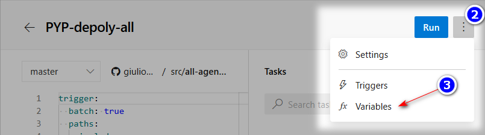
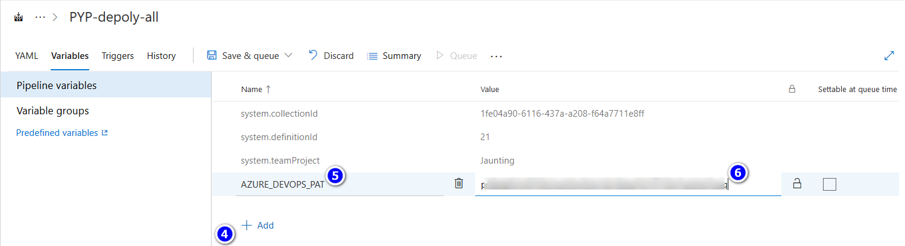
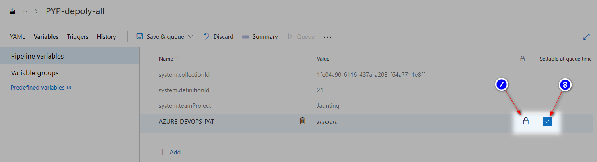
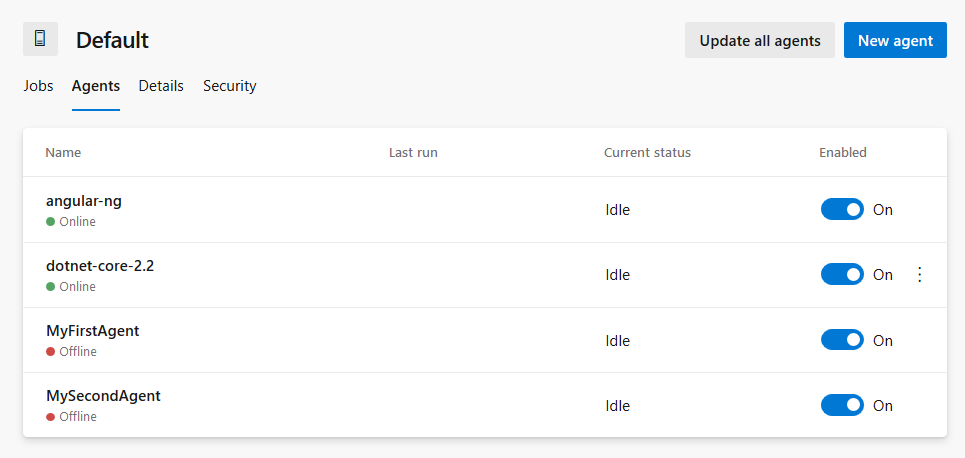

# Meta-pipelines - Part 4 - Deploy and Run

In the previous instalment we built custom Docker images for Azure Pipelines/TFS Agents. In this post, we will explore the lifecycle of Docker containers running such images.


## Container Deploy Pipeline

This pipeline is more complex than the previous requiring 4 actions:
1. checking if the agent (_rectius_ the container running the agent) is running
2. if so, stop and remove the container
3. pulling the image from the selected Docker Registry
4. starting the container with the proper parameters
While logically at third place, the pull operation does not interfere with running containers. This means that we can minimize downtime by making the stop-start sequence contiguous.

Again, we use a generic template plus a YAML build that uses it.
The template has six steps, fleshing out the four actions.

The parameters should be obvious except the distinction between `docker_registry` and `docker_registry_connection`. The former is the hostname of the Docker Registry, the latter is the name for the connection in Azure DevOps.



Hostname is part of the image name, while the connection name is used in the Docker login step.
I recommend naming the connection the same as the Hostname.
Another interesting couple of parameters is `os` vs `os_tag`: the former is the conventional name for the Host OS and Container platform, while the latter is the Agent Capability `Agent.OS`. 

```yaml
parameters:
  os: ''
  os_tag: ''
  toolchain: ''
  toolchain_version: ''
  container_name_suffix: ''
  repo_docker_path: 'src/agents/docker'
  image_name_prefix: 'azure-pipelines-agent'
  docker_registry: 'giuliovprodemo.azurecr.io'
  docker_registry_connection: 'mydemo.azurecr.io'

jobs:
- job: 'deploy_${{ parameters.os }}'
  pool:
    name: MakeAgents
    demands:
    - 'agent.os -equals ${{ coalesce( parameters.os_tag, parameters.os ) }}'
  variables:
    docker_image_id: '${{ parameters.docker_registry }}/${{ parameters.image_name_prefix }}/${{ parameters.os }}/${{ parameters.toolchain }}:${{ parameters.toolchain_version }}'
    container_name: '${{ parameters.toolchain }}-${{ parameters.toolchain_version }}${{ parameters.container_name_suffix }}'
  steps:
  - powershell: |
      echo Must define AZURE_DEVOPS_PAT variable!
      exit 1
    condition: eq(variables['AZURE_DEVOPS_PAT'], '')
    env:
      AZURE_DEVOPS_PAT: '$(AZURE_DEVOPS_PAT)'
  - task: Docker@2
    displayName: Login to Docker Registry
    inputs:
      command: login
      containerRegistry: '${{ parameters.docker_registry_connection }}'
  - task: Docker@2
    displayName: 'Pull $(docker_image_id)'
    inputs:
      command: pull
      arguments: '$(docker_image_id)'
  - powershell: |
      $ContainerName = "$(container_name)"
      $res = docker ps --format "{{.ID}}" --filter "name=$ContainerName"
      $value = if ($res -eq $null) { "false" } else { "true" }
      Write-Host "ContainerIsRunning=$value"
      Write-Output "##vso[task.setvariable variable=ContainerIsRunning;]$value"
    displayName: 'Check if container $(container_name) is running'
  - task: Docker@2
    displayName: 'Stop running container $(container_name)'
    inputs:
      command: rm
      arguments: '--force $(container_name)'
    condition: and(succeeded(), eq(variables['ContainerIsRunning'], 'true'))
  - task: Docker@2
    displayName: 'Run container $(container_name)'
    inputs:
      command: run
      arguments: '--name=$(container_name) --restart=always --env AZP_URL --env AZP_TOKEN --env AZP_POOL --env AZP_AGENT_NAME --detach $(docker_image_id)'
    env:
      AZP_URL: '$(System.TeamFoundationCollectionUri)'
      AZP_TOKEN: '$(AZURE_DEVOPS_PAT)'
      AZP_POOL: 'Default'
      AZP_AGENT_NAME: '$(container_name)'
```

The template requires the _MakeAgents_ Pool and specific Container platform for the image.
After checking if the `AZURE_DEVOPS_PAT` is set (the YAML Template has no provision to require a mandatory global variable), the template pulls the image from the Registry; this can the most expensive operation.
To check if a container with the same name is running on the host, the PowerShell script parse the output of `docker ps` and set the `ContainerIsRunning` variable.
This variable is used to conditionally execute `docker rm --force` to forcibly stop the container.
With a clean state, the template can finally start the container.

### Run the container

The first notable thing is the `--restart=always` to tell Docker to restart the container in all case, included a host machine reboot. This gives a degree of resilience at in case of crashes but can hide issues: if the container has a configuration error, Docker will insist restarting the container. This scenario becomes visible in Azure Pipelines, a minute or two after the pipeline completes successfully: the agent stays offline, when replacing an existing agent, or never shows up.
In such case, connect to the host server, via RDP or SSH, and run `docker logs <container-name>` to see the error output.

The `--detach` option to start the container process asynchronously and freeing the host agent to complete the build. As a consequence, the container may starts successfully but fails after some seconds trying to execute the agent configuration or running the agent.

To avoid explicit display of environment variables in Azure Pipeline logs, the Task sets the environment variables and instruct Docker to forward those to the container. 
Remember that the values will be easily accessible from the host machine. Typing `docker inspect dotnet-core-2.2` outputs all environment variables, including `AZP_TOKEN` (see below).

```
[
    {
        "Id": "73dab022f7c304a6f9e7db6d8d83464b2b4e269c7a894436868135bd52c9ee19",
        "Created": "2019-07-13T21:06:09.1351118Z",
        "Name": "/dotnet-core-2.2",
        "Platform": "windows",
        "Config": {
            "Hostname": "73dab022f7c3",
...omiss...
            "Env": [
                "AZP_URL=https://dev.azure.com/giuliovaad/",
                "AZP_TOKEN=p**************************************************q",
                "AZP_POOL=Default",
                "AZP_AGENT_NAME=dotnet-core-2.2",
                "dotnetcore_2.2=true",
                "AZP_WORK=_work",
                "VSO_AGENT_IGNORE=VSO_AGENT_IGNORE,AZP_AGENT_NAME,AZP_URL,AZP_TOKEN,AZP_POOL"
            ],
        },
...omiss...
    }
]
```

### Using the Template

The pipeline invokes the same template passing which agent we want to start. The `os_tag` is necessary to match the host.

```yaml
trigger:
  batch: true
  paths:
    include:
      - src/agents/*
jobs:
- template: templates/deploy-image.yaml
  parameters:
    os: 'windows'
    os_tag: 'Windows_NT'
    toolchain: 'dotnet-core'
    toolchain_version: '2.2'
- template: templates/deploy-image.yaml
  parameters:
    os: 'linux'
    toolchain: 'angular'
    toolchain_version: 'ng'
```
Each template invocation runs in parallel, being a Pipeline Job.

If you want to start additional copies of the same agent, use the `container_name_suffix` parameter to make the name unique. For example you can add this invocation to the above pipeline.

```yaml
- template: templates/deploy-image.yaml
  parameters:
    os: 'windows'
    os_tag: 'Windows_NT'
    toolchain: 'dotnet-core'
    toolchain_version: '2.2'
    container_name_suffix: '_bis'
```

You can organize your pipelines in a different way to avoid restarting all the agents more or less at the same time. For example you can use a build definition for each agent toolchain.


### Secret variable for PAT

The template requires an Azure DevOps Personal Access Token or PAT to register an agent in the Pool. The PAT must have _Read & manage_ permission at _Agent Pools_ scope.


This variable cannot be defined in YAML and must be added to the Pipeline Definition manually.









Keep in mind that this variable is easily accessible from the Host machine using `docker inspect` command.


## What's next

If we run the above pipeline successfully, we should see, in Azure Pipelines _Default_ Agent Pool, two additional agents.



In future posts we will use go back to the host machines and try to automate those too.