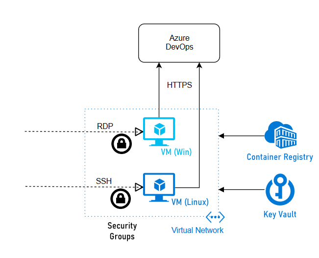

# Meta-pipelines - Part 5 - Automating the Host Environment

Looking back at the previous parts of this series, we have been able to manually setup two hosts, a Windows one and a Linux one, and a simple pipeline to automatically deploy new Azure DevOps/TFS Agents in Docker containers on such hosts and even update them.

In this post we will look how to provision the hosts themselves. For this purpose we will use Terraform and invoke it from Azure Pipelines so we can automate host creation in Azure.

If you need a Terraform primer there is plenty of resources, from the excellent [Terraform: Up & Running](https://www.terraformupandrunning.com/) to the [official documentation](https://www.terraform.io/docs/index.html), Pluralsight courses, etc. I recommend to have at least a cursory knowledge of Terraform and Azure before delving deeper.


## Blueprinting

Terraform will provision the virtual machines to host our Docker containers. The full source code is in the [repository](https://github.com/giuliov/pipeline-your-pipelines), here we will highlight and comment some major points to avoid listing all 500+ lines of code.

### Azure Architecture

The blueprint will have a Resource Group for these Hosts, two sets of Virtual Machines (VMs), one for Windows, one for Linux, an Azure Container Registry to store the agent images and a Key Vault for passwords and certificates.

Each set of VM lives in its own Subnet and respective Network Security Group.

Terraform needs a Service Principal (SP for short), a type of Azure Active Directory (AAD) account, to authenticate. The simplest way to create one is using [Azure CLI](https://docs.microsoft.com/en-us/cli/azure/create-an-azure-service-principal-azure-cli?view=azure-cli-latest) or [Azure PowerShell](https://docs.microsoft.com/en-us/powershell/azure/create-azure-service-principal-azureps?view=azps-2.4.0).

By running similar commands, create the SP. Take note of the output values for Terraform.

```bash
az account list
# take note of output, e.g.
#   [
#     {
#       "cloudName": "AzureCloud",
#       "id": "9cc84c88-b440-42ee-8847-89249a7d67c2",
#       "isDefault": true,
#       "name": "My Magic Azure Subscription",
#       "state": "Enabled",
#       "tenantId": "c6f5c7b6-353c-4af6-8d95-314c58f1fec2",
#       "user": {
#         "cloudShellID": true,
#         "name": "live.com#my_msa_account@outlook.com",
#         "type": "user"
#       }
#     }
#   ]
# 
#   id          -> AZURE_SUBSCRIPTION_ID
#   tenantId    -> AZURE_TENANT_ID
az ad sp create-for-rbac --name AggregatorSPLimitedToTestRG
# take note of output, e.g.
#   {
#     "appId": "56f7583c-4165-43c5-8311-f2e671aa1fdd",
#     "displayName": "MyTerraformServicePrincipal",
#     "name": "http://MyTerraformServicePrincipal",
#     "password": "************************************",
#     "tenant": "c6f5c7b6-353c-4af6-8d95-314c58f1fec2"
#   }
#   appId       -> AZURE_CLIENT_ID
#   password    -> AZURE_CLIENT_SECRET
#   tenant      -> AZURE_TENANT_ID
```

These script are controlled by a number of variables, described in the next table.

variable | use | default
---------|-----|-----------------
env_name | Name of Environment | pyp-demo
resource_group_location | Azure Region of resources | westeurope
acr_sku | SKU of Azure Container Registry | Basic
num_windows_hosts | Number of Windows VMs | 1
num_linux_hosts | Number of Linux VMs | 1
vm_size | Size of VMs (1) | Standard_B1
vm_disk_type | Type of disk storage for VMs (1) | Standard_LRS
vm_admin_username | Username for the Administrator account | hostadmin
vm_public_access | If true the Security Groups allow RDP and SSH access to the VMs | false
azuredevops_pat | Azure DevOps Personal Access Token (2) | —
azuredevops_url | Azure DevOps URL | —
azuredevops_pool_hosts | Azure DevOps Pool for Hosts | —

(1) Default size is the cheapest, which may not be adequate for production usage.
(2) Must have Read & manage permission at Agent Pools scope.

The name of the Registry and the KeyVault must be unique in the whole Azure; to guarantee it we add a random 6 character string to the name. In addition this must not contain any punctuation symbol, so we clean the base environment name.

```terraform
resource "random_id" "env_name" {
  keepers = {
    env_name = var.env_name
  }

  byte_length = 3
}

locals {
  env_name_nosymbols = replace(replace(var.env_name, "-", ""), "_", "")
  name_suffix        = random_id.env_name.hex
}

resource "azurerm_container_registry" "pyp" {
  name                = "${local.env_name_nosymbols}${local.name_suffix}"
  #...omissis...
}
resource "azurerm_key_vault" "pyp" {
  name                = "${local.env_name_nosymbols}${local.name_suffix}"
  #...omissis...
}
```

## Applying the blueprint
TODO 

```yaml
variables:
  TERRAFORM_VERSION: '0.12.3'
  TERRAFORM_WORKSPACE: 'dev'
  TF_IN_AUTOMATION: true
  # these variables are commented to remind that they must be defined through the web interface and marked secure
  # TERRAFORM_REMOTE_TOKEN: ''
  # AZURE_SUBSCRIPTION_ID: ''
  # AZURE_TENANT_ID: ''
  # AZURE_CLIENT_ID: ''
  # AZURE_CLIENT_SECRET: ''
  # AZUREDEVOPS_PAT: ''
  PIPELINE_POOL: 'MakeAgents'
  ENV_NAME: 'pyp-demo'
  RESOURCE_GROUP_LOCATION: 'northeurope'
  ACR_SKU: 'Basic'
  NUM_WINDOWS_HOSTS: 1
  NUM_LINUX_HOSTS: 1
  VM_ADMIN_USERNAME: 'hostadmin'
  VM_SIZE: 'Standard_B2s'
  VM_DISK_TYPE: 'Standard_LRS'
  VM_PUBLIC_ACCESS: true

steps:
- task: DownloadSecureFile@1
  inputs:
    secureFile: 'backend.hcl'
- task: charleszipp.azure-pipelines-tasks-terraform.azure-pipelines-tasks-terraform-installer.TerraformInstaller@0
  displayName: 'Install Terraform $(TERRAFORM_VERSION)'
  inputs:
    terraformVersion: '$(TERRAFORM_VERSION)'
- script: |
   terraform init -no-color -input=false -backend-config="$(Agent.TempDirectory)/backend.hcl"
   # portable way to skip failing command
   terraform apply -no-color -input=false -auto-approve
  workingDirectory: '$(System.DefaultWorkingDirectory)/src/hosts/terraform'
  displayName: 'Terraform apply in $(TERRAFORM_WORKSPACE) workspace'
  env:
    # forward variables to Terraform
    TF_WORKSPACE: $(TERRAFORM_WORKSPACE)
    TF_VAR_azurerm_subscription_id: $(AZURE_SUBSCRIPTION_ID)
    TF_VAR_azurerm_tenant_id: $(AZURE_TENANT_ID)
    TF_VAR_azurerm_client_id: $(AZURE_CLIENT_ID)
    TF_VAR_azurerm_client_secret: $(AZURE_CLIENT_SECRET)
    TF_VAR_azuredevops_url: $(System.TeamFoundationCollectionUri)
    TF_VAR_azuredevops_pat: $(AZUREDEVOPS_PAT)
    TF_VAR_azuredevops_pool_hosts: $(PIPELINE_POOL)
    TF_VAR_env_name: $(ENV_NAME)
    TF_VAR_resource_group_location: $(RESOURCE_GROUP_LOCATION)
    TF_VAR_num_windows_hosts: $(NUM_WINDOWS_HOSTS)
    TF_VAR_num_linux_hosts: $(NUM_LINUX_HOSTS)
    TF_VAR_vm_admin_username: $(VM_ADMIN_USERNAME)
    TF_VAR_vm_size: $(VM_SIZE)
    TF_VAR_vm_disk_type: $(VM_DISK_TYPE)
    TF_VAR_vm_public_access: $(VM_PUBLIC_ACCESS)
    TF_VAR_acr_sku: $(ACR_SKU)
```

This pipeline may looks complex but it is just four activities:
1. download a file with Terraform remote configuration
2. get the correct version of Terraform
3. `terraform init`
4. `terraform apply`